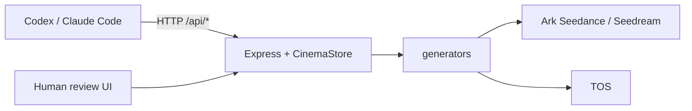

<div align="center">

[中文](README.md) | **[English](README.en.md)**

</div>

# reelyai-agent — Agent operations manual

> **Audience**: Codex, Claude Code, Cursor Agent, and other coding agents.  
> **Not** an end-user product guide. Humans only **provision Volcengine services**, fill `.env`, and **review** in the web UI during setup and production. **You run the pipeline via REST.**

## You must

1. **Use APIs only** — no browser automation. Humans may use `http://localhost:5173` to review; same state as your API calls (`data/cinema-store.json`).
2. **Run «Initialization» below first**. If credentials are missing, **stop real generation** and send the human the **«Tell the user»** Volcengine checklist; never invent keys.
3. Load skills: `reelyai-shortdrama`, `reelyai-agent-session` (under `.cursor/skills` or `~/.codex/skills`), and `reelyai-storyboard-imagegen` when you need contact sheets.
4. **Seedance only fetches `http(s)` references**. Publish local `/media/...` via `POST .../publish-tos` or `PUBLIC_MEDIA_BASE_URL` (not localhost).
5. Treat **manual web edits as source of truth**; refresh with `GET /api/state` before continuing.

```bash
BASE_URL="${REELYAI_AGENT_BASE_URL:-${CINEMA_AGENT_BASE_URL:-http://localhost:5173}}"
```

---

## Initialization (every time you take this repo)

Execute in order. Do not start paid generation until gates pass.

| Step | You run | Pass when |
| --- | --- | --- |
| 1 | `npm install` (and `npm run install:skill` if needed) | Skills installed under `~/.codex/skills`, etc. |
| 2 | If no `.env`: `cp .env.example .env` | File exists |
| 3 | Read `.env` against **credential gates** below | Missing → **Phase A** only |
| 4 | `npm run dev` in background | `curl -sS "$BASE_URL/api/state"` returns JSON |
| 5 | Tell the human `BASE_URL` for review | Same URL in browser |

**Credential gates (minimum for real video)**

| Capability | `.env` | If missing |
| --- | --- | --- |
| Seedance shot video | `BP_ARK_API_KEY` or `ARK_API_KEY` / `SEEDANCE_API_KEY` | Mock video only — **do not** claim real renders |
| Codex/local refs into Seedance | `TOS_*` **or** non-localhost `PUBLIC_MEDIA_BASE_URL` | Refs omitted from Seedance payload |
| Asset library Seedream | `SEEDREAM_API_KEY` or Ark key fallback | Mock assets; or Codex `imagegen` + `sketches/import` |

Optional: `OPENAI_API_KEY` (script), `VOLC_TTS_*` (narration), `SEEDANCE_API_URL` (custom endpoint).

Without keys you may exercise mock/UI flows but must say **mock mode** explicitly.

---

## Phase A — Tell the user: Volcengine setup (send when gates fail)

**Pause production.** Send this checklist (trim completed items). Resume after `.env` is filled and you re-check `/api/state`.

```markdown
### Please enable on Volcengine / BytePlus (required for ReelyAI Agent)

#### 1. Ark — API Key (required for Seedance video)
- Console: [Volcengine Ark](https://console.volcengine.com/ark) or [BytePlus ModelArk](https://console.byteplus.com/ark) (region must match `SEEDANCE_API_BASE` / `SEEDREAM_API_BASE` in `.env`).
- Create an **API Key** → project `.env`:
  - `BP_ARK_API_KEY=<key>` (preferred), or `ARK_API_KEY=<key>`
- Ensure **Seedance 2.0** video is enabled (defaults: `dreamina-seedance-2-0-260128`, fast: `dreamina-seedance-2-0-fast-260128`).
- CN base is often `https://ark.cn-beijing.volces.com/api/v3`; BytePlus example in `.env.example`: `https://ark.ap-southeast.bytepluses.com/api/v3`.

#### 2. Ark — Seedream images (recommended for character/scene assets)
- Usually same Ark key; set `SEEDREAM_API_KEY` or leave empty to reuse `BP_ARK_API_KEY`.
- Enable **Seedream 4.5** (`seedream-4-5-251128`) or 4.0 (`seedream-4-0-250828`).

#### 3. TOS object storage (required if references / Codex boards feed Seedance)
- Console: [Volcengine TOS](https://console.volcengine.com/tos).
- Create a **bucket** + **access key** AK/SK.
- `.env`: `TOS_ACCESS_KEY_ID`, `TOS_SECRET_ACCESS_KEY`, `TOS_REGION`, `TOS_ENDPOINT`, `TOS_BUCKET`, `TOS_KEY_PREFIX`.
- Private bucket: omit `TOS_PUBLIC_BASE_URL` → app uses **pre-signed URLs** (default 7d).
- Public bucket/CDN: set `TOS_PUBLIC_BASE_URL` to the object root.

**Alternative**: public tunnel to `npm run dev` + `PUBLIC_MEDIA_BASE_URL=https://<host>` (no localhost).

#### 4. Optional — OpenAI (script / GPT Image 2 in-app)
- `OPENAI_API_KEY` or `OAI_KEY`. **Codex built-in imagegen ≠ in-app OpenAI** — still import via `POST /api/shots/:shotId/sketches/import`.

#### 5. Optional — OpenSpeech TTS (narration + subtitles)
- Docs: <https://www.volcengine.com/docs/6561/1598757>
- `VOLC_TTS_APPID`, `VOLC_TTS_TOKEN`; default `VOLC_TTS_RESOURCE_ID=seed-tts-1.0`.

#### 6. Local machine
- Node.js (~22), `npm install`, `npm run dev`.
- ffmpeg bundled; subtitle fonts: see `.env.example` `NARRATION_SUBTITLE_*`.

Save `.env` and tell the agent to continue; agent verifies `npm run dev` + `/api/state`.
```

**You verify**

```bash
curl -sS "$BASE_URL/api/state" | head -c 200
# After TOS: POST .../sketches/publish-tos or .../storyboards/publish-tos on a local sketch
```

---

## Phase B — Production pipeline (API)

Default **staged confirmation**: pause after `script/generate` and `storyboard` for human web edits; continue on explicit user go-ahead. Full auto only when asked; still report `BASE_URL`.

| # | Action | API / notes |
| --- | --- | --- |
| 1 | Create session | `POST /api/sessions` — `shotCount` ≥ `ceil(targetDurationSec/15)`, max 15s per shot |
| 2 | Script | `POST /api/sessions/:id/script/generate` → **pause** |
| 3 | Assets | Reuse from `GET /api/state`; else `POST /api/assets` + `POST .../generate` (`seedream-4-5`); `@name` in prompts |
| 4 | Storyboard | Codex `imagegen` or `reelyai-storyboard-imagegen` → `sketches/import` → **publish-tos** |
| 5 | Shot list | `POST /api/sessions/:id/storyboard` → **pause** |
| 6 | Video | Shot 2+: `PATCH` `usePreviousShotClip:true`, `previousShotClipSec:2`; `POST .../generate` → `.../poll` until `ready`; **serial** for continuity |
| 7 | Stitch | All `ready` → `POST .../stitch` → `.../stitch/poll` until `stitchStatus=ready` |
| 8 | Deliver | `GET /api/sessions/:id/download` + web URL |

**Shot-1 first frame** (only if user asks): `PATCH` `firstFrameAssetId`; asset `mediaUrl` must be `https://`; mutually exclusive with other reference media.

**Endpoints** (curl detail: `.cursor/skills/reelyai-agent-session/reference.md`):

`GET /api/state` · `POST .../script/generate` · `POST .../storyboard` · `POST /api/shots/:id/generate` · `POST .../poll` · `POST .../storyboards/publish-tos` · `POST .../stitch` · `POST .../stitch/poll`

## Architecture



- You: plan, prompts, which APIs to call.
- Video / in-app Seedream: server-side after `/api/*`.
- Codex `imagegen`: your runtime → `sketches/import` → TOS → `generate`.

## Data & mock

- `data/cinema-store.json` — `assets`, `sessions`, `shots`.
- No Ark key → mock media; label **mock** to the user.

## More rules

- [AGENTS.md](AGENTS.md)  
- [docs/agent-workflow.md](docs/agent-workflow.md)  
- [skills/reelyai-shortdrama/SKILL.md](skills/reelyai-shortdrama/SKILL.md)  

## Humans (minimal)

Humans **provision Volcengine + `.env`**, then **review/edit** in the web UI. You send `BASE_URL` and the active session title.
