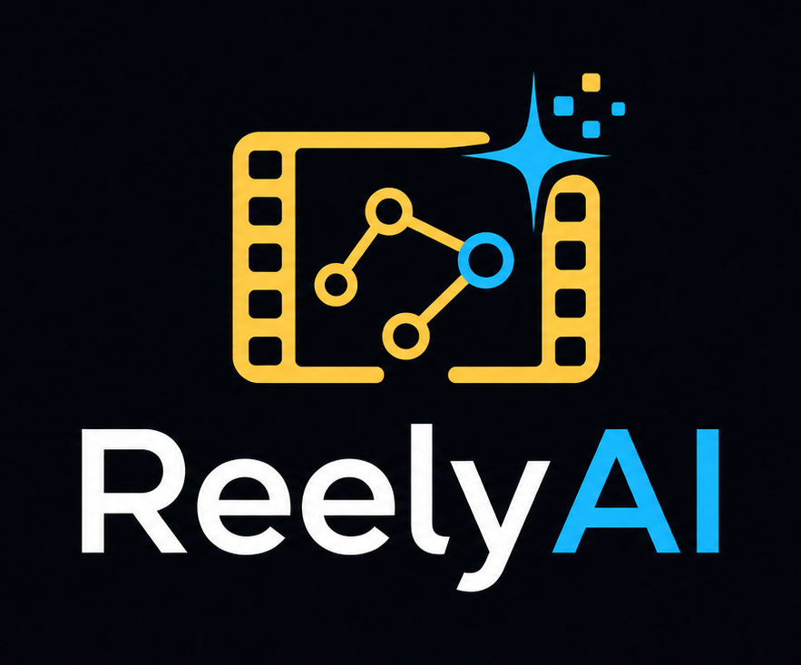
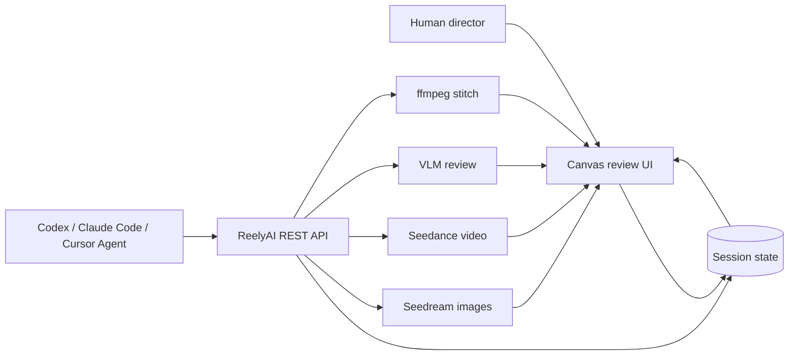

<p align="center">
  
</p>

<p align="center">
  <strong>Agent-native short-film production workstation.</strong>
</p>

<p align="center">
  Create reviewable video workflows with Codex, Claude Code, Cursor Agent, and the ReelyAI canvas — powered by <a href="https://www.volcengine.com/docs/82379/2366394?lang=zh">Volcengine Agent Plan</a>.
</p>

<p align="center">
  <strong>English</strong> · <a href="README.zh-CN.md">中文文档</a>
</p>

ReelyAI lets you create a short video by talking to an agent in **Codex, Claude Code, Cursor Agent, or any AGENTS.md-compatible runtime**. The agent turns your creative instruction into a visible canvas workflow: character and scene assets, storyboard boards, Seedance video nodes, review nodes, stitch jobs, and the final downloadable cut.

**ReelyAI is built to showcase [Volcengine Agent Plan](https://www.volcengine.com/docs/82379/2366394?lang=zh).** One Agent Plan subscription can fuel the full short-film loop — **Seedream** reference images, **Seedance 2.0** shot videos, and **Seed** / VLM review — through a single API key and the dedicated `/api/plan/v3` route, with session-level token usage visible in the canvas.

The canvas is not just a progress screen. It is the human takeover surface. You can pause in the middle, edit prompts, reconnect references, regenerate weak nodes, inspect VLM feedback, and change the final result before the agent continues.


## Recommended: Volcengine Agent Plan

[Agent Plan](https://www.volcengine.com/docs/82379/2366394?lang=zh) is Volcengine Ark’s subscription package for **Agent workloads**. Instead of wiring separate pay-as-you-go keys for every model, Agent Plan bundles the models and harness tools an agent actually needs — text, image, video, web search, and memory — and meters usage with **Agent Fuel Points (AFP)**.

| What you get | Why it matters for ReelyAI |
| --- | --- |
| **Doubao-Seed** text models | Script planning, prompt expansion, and agent reasoning |
| **Doubao-Seedream** (`doubao-seedream-5.0-lite`) | Character, scene, prop, and storyboard reference images |
| **Doubao-Seedance 2.0** / **2.0-fast** | Multi-shot short-film video generation |
| **Harness tools** | Web search, embeddings, and other agent-side capabilities documented in the [Agent Plan guide](https://www.volcengine.com/docs/82379/2366394?lang=zh) |

**We recommend Agent Plan as the default way to run ReelyAI in production.** The project routes Seedream, Seedance, and VLM review calls through one `ARK_AGENT_PLAN_KEY`, tracks usage per canvas node, and keeps the UI aligned with the models your plan actually exposes.

**Quick path**

1. Read the official [Agent Plan package overview](https://www.volcengine.com/docs/82379/2366394?lang=zh) and subscribe on the [Agent Plan activity page](https://www.volcengine.com/activity/agentplan).
2. Create an **Agent Plan API Key** in the [Volcengine Ark console](https://console.volcengine.com/ark).
3. Add the key to `.env` and opt in:

```bash
ARK_AGENT_PLAN_KEY=<your-agent-plan-key>
REELYAI_USE_AGENT_PLAN=1
ARK_AGENT_PLAN_BASE=https://ark.cn-beijing.volces.com/api/plan/v3
SEEDREAM_AGENT_PLAN_MODEL=doubao-seedream-5.0-lite
SEEDANCE_AGENT_PLAN_MODEL=doubao-seedance-2-0-260128
SEEDANCE_AGENT_PLAN_FAST_MODEL=doubao-seedance-2-0-fast-260128
```

4. Configure **TOS** separately so local/Codex storyboards become remote `https://` references Seedance can fetch. Agent Plan covers model tokens; it does **not** replace object storage.

See [Minimum Real-Generation Setup](#minimum-real-generation-setup) for the full credential table and fallback Ark keys.

**Official docs**

- [Agent Plan package overview](https://www.volcengine.com/docs/82379/2366394?lang=zh)
- [Connect multimodal generation models](https://www.volcengine.com/docs/82379/2373738?lang=zh)
- [Build a short-video site with Agent Plan](https://www.volcengine.com/docs/82379/2366394?lang=zh) — ReelyAI is the open-source canvas version of that workflow

## Why ReelyAI

Most video-generation tools stop at “submit a prompt and hope.” ReelyAI is built around an agent loop where the conversation and the canvas stay synchronized:

- **Plan**: turn an idea into script beats, shots, prompts, and references.
- **Build the workflow**: create visible graph nodes for assets, storyboards, videos, reviews, and stitching.
- **Generate**: create Seedream image assets, storyboard grids, and Seedance 2.0 video shots.
- **Review every node**: use VLM checks to score images, clips, and final videos against the prompt.
- **Repair**: surface concrete problems and prompt fixes so the next generation improves.
- **Deliver**: stitch ready shots, add narration/subtitles when configured, and download the final video.

The core idea: every intermediate artifact stays visible and editable. Nothing important is hidden in an agent scratch folder.

## VLM Review Is A First-Class Feature

ReelyAI includes review agents for generated media, not just generation buttons. Each important generation node can be checked by a VLM reviewer, and the latest review summary is shown in the Inspector so humans and agents can make better next moves.

| Review surface | What it checks |
| --- | --- |
| Asset image review | Whether a generated character, prop, scene, or storyboard follows the prompt and references |
| Shot video review | Whether a Seedance clip follows the shot intent, continuity, action, composition, and visual constraints |
| Final video review | Whether the stitched cut is coherent across shots and ready to publish |
| Node review summary | Inspector cards show the latest score, summary, reasons, and suggested fixes |
| Token usage | Session-level usage panel tracks Seedream / Seedance / review model cost by node |

When review is enabled, ReelyAI can retry image generation with VLM feedback folded back into the prompt. Even when a result is not perfect, the Inspector tells the user what is wrong and how to revise. This makes the product useful for real creative iteration, not only one-shot demos.

## Product Flow



## Human-In-The-Loop Canvas

You can ask an agent for a full video, but you are never locked out of the process.

1. Tell Codex or Claude Code what to make.
2. The agent creates the session and builds the canvas workflow through the REST API.
3. The web UI shows assets, reference wiring, storyboard panels, video nodes, stitch nodes, and review results.
4. A human can edit any prompt, add or remove references, reconnect nodes, change duration, trigger review, or regenerate one node.
5. The agent can resume from the updated state and continue toward the final video.

Manual UI edits are treated as source of truth. The agent refreshes `/api/state` before continuing, so human decisions influence the final generation instead of being overwritten.

## What You Can Build

- Short-drama prototypes with repeatable character and scene references
- Storyboard-to-video workflows where each shot has inspectable references
- Reference-video remakes with shot parsing and prompt reuse
- Multi-shot action sequences with previous-shot continuity
- Reviewable final cuts with downloadable output
- Agent-driven production sessions that a human can interrupt and edit at any time

## Quick Start

Requirements:

- Node.js 22+
- npm

```bash
git clone https://github.com/feifeibear/reelyai-agent.git
cd reelyai-agent
npm install
cp .env.example .env
npm run dev
```

Open the printed localhost URL, usually:

```text
http://localhost:5173
```

Without provider keys, the app still opens and can be explored in mock mode. For real generation, **start with Agent Plan** (recommended) or fall back to standard Ark keys.

## Minimum Real-Generation Setup

**Recommended:** [Volcengine Agent Plan](https://www.volcengine.com/docs/82379/2366394?lang=zh) — one subscription for Seedream + Seedance + review-model calls.

| Capability | Environment |
| --- | --- |
| **Recommended** Agent Plan route | `ARK_AGENT_PLAN_KEY` + `REELYAI_USE_AGENT_PLAN=1` — see [Agent Plan section](#recommended-volcengine-agent-plan) |
| Fallback Ark model calls | `BP_ARK_API_KEY` / `ARK_API_KEY` / service-specific keys |
| Seedream images | Agent Plan route (default `doubao-seedream-5.0-lite`) or Ark / `SEEDREAM_API_KEY` |
| Seedance videos | Agent Plan route (default `doubao-seedance-2-0-260128`) or Ark with Seedance 2.0 access |
| Local media as remote references | TOS config or a public `PUBLIC_MEDIA_BASE_URL` |
| Optional script generation | `OPENAI_API_KEY` / `OAI_KEY` |
| Optional narration | `VOLC_TTS_APPID` / `VOLC_TTS_TOKEN` |

Agent Plan example:

```bash
ARK_AGENT_PLAN_KEY=<your-agent-plan-key>
REELYAI_USE_AGENT_PLAN=1
ARK_AGENT_PLAN_BASE=https://ark.cn-beijing.volces.com/api/plan/v3
SEEDREAM_AGENT_PLAN_MODEL=doubao-seedream-5.0-lite
SEEDANCE_AGENT_PLAN_MODEL=doubao-seedance-2-0-260128
SEEDANCE_AGENT_PLAN_FAST_MODEL=doubao-seedance-2-0-fast-260128
```

In Agent Plan mode, Seedream defaults to Seedream 5 Lite. The UI shows the same model that is actually used, so users do not see “Seedream 4.5” when the backend is running `doubao-seedream-5.0-lite`.

## Media Reference Rule

Seedance workers need references they can fetch.

Image references can sometimes be sent inline as Base64 when they are small enough. Video references and durable shared media still need public or signed `http(s)` URLs.

Use one of:

- TOS pre-signed URLs
- `PUBLIC_MEDIA_BASE_URL` pointing to a reachable media host
- Seedream-generated remote URLs returned by Ark

Local `/media/...` and localhost URLs are only reliable for app preview. They are not durable remote references for Seedance workers.

## Agent Skills

This repo ships cross-agent skills in `.agents/skills/`:

| Skill | Use |
| --- | --- |
| `reelyai-shortdrama` | End-to-end short-drama production |
| `reelyai-agent-session` | REST-driven session control |
| `reelyai-script-chat` | Script and casting chat flow |
| `reelyai-storyboard-imagegen` | Storyboard contact-sheet prompting |

`npm install` runs a best-effort mirror into detected runtimes. You can refresh manually:

```bash
npm run install:skill
```

Target a runtime:

```bash
npm run install:skill -- --agent codex
npm run install:skill -- --agent claude
npm run install:skill -- --agent cursor
npm run install:skill -- --agent all
```

## REST API Surface

The web UI and agents share the same API and persisted state.

| Task | Endpoint |
| --- | --- |
| Get full state | `GET /api/state` |
| Create session | `POST /api/sessions` |
| Generate script | `POST /api/sessions/:sessionId/script/generate` |
| Create / update assets | `POST /api/assets`, `PATCH /api/assets/:assetId` |
| Generate asset image | `POST /api/assets/:assetId/generate` |
| Generate storyboard | `POST /api/sessions/:sessionId/storyboard` |
| Generate shot video | `POST /api/shots/:shotId/generate` |
| Poll shot video | `POST /api/shots/:shotId/poll` |
| Run shot review | `POST /api/shots/:shotId/review` |
| Stitch final video | `POST /api/sessions/:sessionId/stitch` |
| Poll stitch | `POST /api/sessions/:sessionId/stitch/poll` |
| Download final video | `GET /api/sessions/:sessionId/download` |
| View / clear token usage | `GET /api/state`, `DELETE /api/sessions/:sessionId/token-usage` |

See [AGENTS.md](AGENTS.md) and `.agents/skills/reelyai-agent-session/reference.md` for operating details.

## Project Layout

```text
src/server/        Express API, generators, VLM review, stitch, narration
src/client/        React + React Flow review UI
src/shared/        Session, asset, shot, review, and token usage types
.agents/skills/    Agent-native workflows
scripts/           Smoke tests and operational helpers
docs/              Product docs, canvas model, screenshots, security notes
data/              Local runtime state and generated media, gitignored
```

## Development

```bash
npm run build
npm run dev
```

Production-style local run:

```bash
NODE_ENV=production PORT=5174 npm run start
```

## Public Volcengine Deployment

For the first public release, use one Volcengine ECS instance with Docker Compose and a persistent
volume. With an ECS public IP and SSH access, run [deploy/deploy-to-ecs.sh](deploy/deploy-to-ecs.sh);
see [deploy/volcengine.md](deploy/volcengine.md) for the full runbook.

Do not set your own `ARK_AGENT_PLAN_KEY` on a public server. Visitors enter their own Agent Plan
token in the top bar; the backend keeps it in process memory and never returns it from `/api/state`.
TOS remains a backend-only server credential, preferably with a private bucket and signed URLs.

Health check:

```bash
curl -sS http://localhost:5173/api/healthz
```

## Security Notes

Do not commit provider keys, pre-signed URLs, generated private media, or `data/cinema-store.json`.

Read [docs/security-git.md](docs/security-git.md) before pushing changes.

## Learn More

- [AGENTS.md](AGENTS.md): agent operating guide
- [docs/canvas-node-model.md](docs/canvas-node-model.md): graph and node model
- [docs/agent-workflow.md](docs/agent-workflow.md): agent workflow notes
- [README.zh-CN.md](README.zh-CN.md): Chinese documentation
