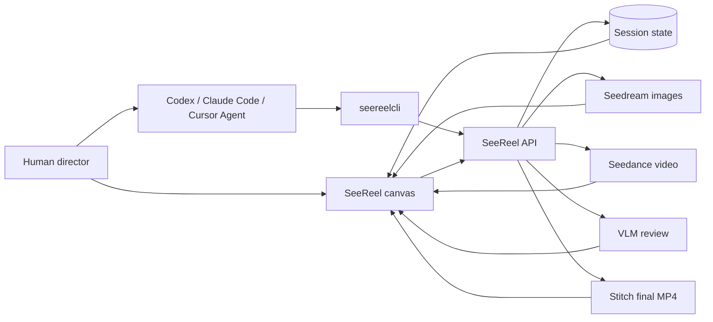

<p align="center">
  
</p>

<p align="center">
  <strong>Agent-native short-drama production workstation.</strong>
</p>

<p align="center">
  Turn one story idea into a visible video canvas for minutes-long videos, powered by Seedance 2.0.
</p>

<p align="center">
  <a href="README.zh-CN.md"><strong>中文文档</strong></a>
  ·
  <a href="https://seereel.studio/"><strong>Free web trial</strong></a>
  ·
  <a href="https://seereel.studio/ai-use-me.html"><strong>AI use me</strong></a>
  ·
  <a href="LICENSE">MIT License</a>
</p>

<p align="center">
  For everyday usage, the most cost-effective option is the CNY 200/month <a href="https://www.volcengine.com/docs/82379/2366394?lang=zh">Volcengine Agent Plan</a>.
</p>

## Demo: Vibe Creating Through Chat

This 30-second one-shot drone route was created from a single chat request and one reference image. SeeReel generated the final video while keeping the production graph visible: uploaded reference, storyboard nodes, Seedance shots, a tail-frame continuity bridge, and the stitch node.

<table>
  <tr>
    <td width="42%" valign="top">
      <h3>User input</h3>
      <p><strong>User input</strong></p>
      <pre style="white-space: pre-wrap;"><code>Use SeeReel.
Reference this image and generate a 30-second
first-person drone video that follows the route
drawn in the image, as a single continuous shot.</code></pre>
      <p><strong>Reference image</strong></p>
      
    </td>
    <td width="58%" valign="top">
      <h3>Codex reply (GPT 5.5)</h3>
      <p><strong>Done. The SeeReel session is:</strong></p>
      <p>
        <a href="https://seereel.studio/">Handoff link</a><br />
        Session: <code>ses_f65954c9</code><br />
        Final cloud download:
        <a href="https://seereel.studio/api/sessions/ses_f65954c9/download">
          https://seereel.studio/api/sessions/ses_f65954c9/download
        </a>
      </p>
      <p><strong>The final video has been downloaded locally:</strong></p>
      <video src="https://github.com/user-attachments/assets/e2c518ec-a8de-42b6-8e7f-953a0bbd2ad6" controls></video>
      <p>
        <strong>Validation result:</strong> 30.167s, 720x1280, 6.0 MB MP4 preview. SeeReel confirms that both shots are ready, stitch is ready, and there are 0 failed shots. The workflow keeps the uploaded reference image, two cloud storyboard segments, two 15s Seedance shots, shot 1's tail-frame asset <code>asset_4166c2e4</code>, and shot 2 is configured with <code>firstFrameAssetId=asset_4166c2e4</code> for first-frame continuity.
      </p>
      <p>
        Apart from uploading the user's local reference image and downloading the final video locally, all intermediate results were generated in the SeeReel cloud and kept in the session.
      </p>
    </td>
  </tr>
</table>

The handoff link opens this session's workflow in the SeeReel web app.


The user does not only watch the final video. They can return to this canvas, revise the reference image, prompt, storyboard, generated shots, first-frame continuity bridge, or stitch node, and then continue production from the edited point.

Reference image source: [4K Wallpapers](https://4kwallpapers.com/world/shanghai-city-9420.html).

## What SeeReel Does

SeeReel is a production cockpit for AI-assisted filmmaking. Instead of hiding work in an agent scratch folder, it keeps every important creative object visible on a canvas:

- **Story**: logline, beat plan, script, shot list, and duration targets.
- **References**: character, scene, prop, storyboard, first-frame, and previous-shot continuity assets.
- **Generation**: Seedream images and Seedance 2.0 video shots, one node at a time.
- **Review**: VLM checks for assets, shots, and the stitched final video.
- **Repair**: prompt fixes, regeneration, polling, and partial recovery without losing graph state.
- **Delivery**: stitched MP4, browser playback, and download links.

The intended loop is simple: **tell an AI agent what you want to make, review and edit the workflow in the browser, then let the agent continue to real video generation only after you approve the plan.**

## Pick Your Path

| Path | Best for | What you do | What the AI does |
| --- | --- | --- | --- |
| **1. Free web trial** | First-time visitors who just want to see the product effect | Open [seereel.studio](https://seereel.studio/) and try the public canvas. If the free quota is exhausted, continue with Path 2. | Reads [AI use me](https://seereel.studio/ai-use-me.html), creates a reviewable workflow, and returns a one-time handoff link. |
| **2. Bring your Agent Plan token** | Users who tried it and want to generate their own real videos | Open [Volcengine Agent Plan](https://www.volcengine.com/activity/agentplan), create an Agent Plan API key, then paste it into the SeeReel top-bar Agent Plan control on [seereel.studio](https://seereel.studio/). | Continues from the same reviewable workflow, renders approved shots, runs review, stitches the final video, and returns the download link. |
| **3. Run on localhost** | Builders with deeper customization needs | Clone this repo, install dependencies, configure `.env`, and open `http://localhost:5173`. | Uses the local API/CLI against your own code, keeps state in the web app, and helps you customize models, prompts, UI, storage, and deploys. |

## If You Are An AI Agent

This repository is written for agents first. Before operating SeeReel for a human, read the live agent guide:

```text
https://seereel.studio/ai-use-me.html
```

Then follow this review-first flow:

```bash
npm install -g seereelcli
seereelcli skill install --agent all
seereelcli skill print
seereelcli workflow "a one-minute short drama about a courier who discovers tomorrow's memories in a broken phone" \
  --base-url https://seereel.studio \
  --duration 60 \
  --json
```

Return the `handoffUrl` to the human, not only the raw `webUrl`. Browser sessions and CLI sessions are cookie-scoped separately, so the handoff URL lets the human claim the AI-created workflow in their normal browser.

Only continue to paid or quota-consuming video generation after the human confirms that Agent Plan access is configured and the workflow looks acceptable:

```bash
seereelcli status --session latest --deep --json
seereelcli render --session latest --stitch --progress --json
```

Important boundaries:

- Prefer CLI/API operations over browser automation.
- Refresh status before continuing after any human web edit.
- Do not invent, scrape, print, or expose API keys.
- Do not call paid generation until the human has approved continuing.
- Keep generated assets, prompts, renders, stitch state, and final videos visible in SeeReel state.
- Seedance references must be remote `http(s)` URLs. Publish local references to TOS before using them as `reference_image`.

## For A New User: Ask Your AI This

Copy this into Codex, Claude Code, Cursor Agent, or another local coding agent:

```text
Read https://seereel.studio/ai-use-me.html and help me create my first SeeReel video.
Start with a reviewable workflow on https://seereel.studio.
Use this idea: "a tired game designer meets the NPC he abandoned years ago".
Return the handoffUrl so I can review the story, shots, and prompts in my browser.
Do not render paid video until I confirm my Agent Plan token is configured.
```

After the workflow looks good, paste your Agent Plan token in the SeeReel top bar or ask the AI to guide you through CLI token configuration, then continue:

```text
My Agent Plan token is configured. Inspect the latest SeeReel workflow, render the missing shots, run review, stitch the final video, and give me the download link.
```

## Why It Matters: Human-AI Co-Creation

SeeReel is an **agent-operable, human-takeover canvas for filmmaking**:

- The AI can create, inspect, update, render, review, repair, and stitch through stable commands.
- The human can interrupt at any point and edit the same session in the web app.
- The canvas remains the source of truth for scripts, shots, prompts, references, renders, reviews, and final videos.
- When a user gives a rough script idea, agents should research relevant characters, plot mechanics, and historical background before drafting; then run script review iterations and revise until the review is satisfied. Unless the user asks for interactive discussion, agents should work autonomously and return the review-ready canvas.
- Agents should prefer full 15-second Seedance shots and pack multiple related beats into one clip when continuity is shared, instead of splitting every beat into a shorter video.
- Agents should plan camera language before rendering: motivated movement or intentional lock-off, clear blocking and screen direction, and cut bridges through action, eyeline, reaction, inserts/cutaways, sound, previous-tail, or tailframe continuity.
- Important prompt information should reach the audience through character dialogue or voiceover/narration, backed by visible action or reaction, instead of staying hidden in prompt-only lore or subtitles.
- Dialogue workflows keep one spoken language across the session and default to natural diegetic sound; agents should not add per-shot music/BGM/score because stitched clips will not share one continuous soundtrack.
- VLM review is part of the product loop, not an afterthought.
- It supports public web trials, bring-your-own-token generation, and local source-level customization.



## Localhost Setup

Requirements:

- Node.js 22+
- npm

```bash
git clone https://github.com/feifeibear/seereel-agent.git
cd seereel-agent
npm install
cp .env.example .env
npm run dev
```

Open the printed local URL, usually:

```text
http://localhost:5173
```

Production-style local run:

```bash
NODE_ENV=production PORT=5174 npm run start
```

Without provider keys, the app still opens and can be explored in mock mode. For real generation, configure API Keys and TOS.

## Real Generation Setup

Default route: [Volcengine Agent Plan](https://www.volcengine.com/docs/82379/2366394?lang=zh). One Agent Plan key can cover SeeReel's Seedream image generation, Seedance video generation, and Seed/VLM review path through the dedicated `/api/plan/v3` route.

```bash
ARK_AGENT_PLAN_KEY=<your-agent-plan-key>
ARK_AGENT_PLAN_BASE=https://ark.cn-beijing.volces.com/api/plan/v3
SEEDREAM_AGENT_PLAN_MODEL=doubao-seedream-5.0-lite
SEEDANCE_AGENT_PLAN_MODEL=doubao-seedance-2-0-260128
SEEDANCE_AGENT_PLAN_FAST_MODEL=doubao-seedance-2-0-fast-260128
VISION_REVIEW_AGENT_PLAN_MODEL=doubao-seed-2.0-pro
VIDEO_ANALYZE_AGENT_PLAN_MODEL=doubao-seed-2.0-pro
```

Preferred local route when available: standard Ark API keys. If BP, CN, and Agent Plan keys are all configured, SeeReel uses `BP > CN > Agent Plan`:

```bash
BP_ARK_API_KEY=<your-standard-ark-api-key>
BP_SEEDREAM_API_KEY=<optional-seedream-only-bp-key>
BP_SEEDREAM_API_BASE=https://ark.ap-southeast.bytepluses.com/api/v3
BP_SEEDANCE_API_KEY=<optional-seedance-only-bp-key>
BP_SEEDANCE_API_BASE=https://ark.ap-southeast.bytepluses.com/api/v3

CN_ARK_API_KEY=<your-cn-ark-api-key>
CN_SEEDREAM_API_KEY=<optional-seedream-only-cn-key>
CN_SEEDREAM_API_BASE=https://ark.cn-beijing.volces.com/api/v3
CN_SEEDANCE_API_KEY=<optional-seedance-only-cn-key>
CN_SEEDANCE_API_BASE=https://ark.cn-beijing.volces.com/api/v3
SEEDANCE_CN_MODEL=doubao-seedance-2-0
```

TOS is separate and still required when local or Codex-generated references must be sent to remote Seedance workers:

```bash
TOS_ACCESS_KEY_ID=<AK>
TOS_SECRET_ACCESS_KEY=<SK>
TOS_REGION=cn-beijing
TOS_ENDPOINT=tos-cn-beijing.volces.com
TOS_BUCKET=<bucket>
TOS_KEY_PREFIX=cinema-agent/storyboards
TOS_PRESIGN_EXPIRES_SEC=604800
```

Fallback and optional providers:

| Capability | Environment |
| --- | --- |
| Seedream BP standard API | `BP_ARK_API_KEY` / `BP_SEEDREAM_API_KEY` |
| Seedream CN standard API | `CN_ARK_API_KEY` / `CN_SEEDREAM_API_KEY` |
| Seedance BP standard API | `BP_ARK_API_KEY` / `BP_SEEDANCE_API_KEY` |
| Seedance CN standard API | `CN_ARK_API_KEY` / `CN_SEEDANCE_API_KEY` |
| Agent Plan | `ARK_AGENT_PLAN_KEY` |
| Optional script generation | `OPENAI_API_KEY` / `OAI_KEY` |
| Optional narration | `VOLC_TTS_APPID` / `VOLC_TTS_TOKEN` |
| Public media fallback | non-localhost `PUBLIC_MEDIA_BASE_URL` |

## Public Deployment

The public product currently runs at:

```text
https://seereel.studio
```

For your own deployment, the simplest production shape is one Volcengine ECS instance with Caddy, persistent storage, and either Docker Compose or systemd. See [deploy/volcengine.md](deploy/volcengine.md) for the full runbook.

Do not put a personal Agent Plan key into a public frontend bundle. For a public server:

- Visitors paste their own Agent Plan token in the browser top bar.
- CLI users configure their own local token with `seereelcli configure --agent-plan-token`.
- Server-side free-trial keys, if enabled, must be stored as protected runtime configuration.
- Admin credentials and provider secrets must stay out of README screenshots, logs, frontend code, and GitHub.

## Agent Skills

This repo ships cross-agent skills in `.agents/skills/`. `npm install` runs a best-effort mirror into detected runtimes; refresh manually anytime:

```bash
npm run install:skill
```

| Skill | Use |
| --- | --- |
| `seereel-shortdrama` | End-to-end short-drama production |
| `seereel-canvas-review` | Review-first script, cast, scene, storyboard, and shot-prompt canvas |
| `seereel-agent-session` | REST-driven session control |
| `seereel-cli` | Local CLI workflow and fine-grained node control |
| `seereel-script-chat` | Script and casting chat flow |
| `seereel-storyboard-imagegen` | Storyboard contact-sheet prompting |

Target one runtime or all detected runtimes:

```bash
npm run install:skill -- --agent codex
npm run install:skill -- --agent claude
npm run install:skill -- --agent cursor
npm run install:skill -- --agent all
```

## API Surface

The web UI, CLI, and agents share the same API and persisted state.

| Task | Endpoint |
| --- | --- |
| Get full state | `GET /api/state` |
| Create session | `POST /api/sessions` |
| Generate script | `POST /api/sessions/:sessionId/script/generate` |
| Create / update assets | `POST /api/assets`, `PATCH /api/assets/:assetId` |
| Generate asset image | `POST /api/assets/:assetId/generate` |
| Generate storyboard | `POST /api/sessions/:sessionId/storyboard` |
| Publish storyboard references | `POST /api/sessions/:sessionId/storyboards/publish-tos` |
| Generate shot video | `POST /api/shots/:shotId/generate` |
| Poll shot video | `POST /api/shots/:shotId/poll` |
| Run shot review | `POST /api/shots/:shotId/review` |
| Stitch final video | `POST /api/sessions/:sessionId/stitch` |
| Poll stitch | `POST /api/sessions/:sessionId/stitch/poll` |
| Download final video | `GET /api/sessions/:sessionId/download` |
| Export editable session package | `GET /api/sessions/:sessionId/export` |
| Import editable session package | `POST /api/sessions/import` |

See [AGENTS.md](AGENTS.md) and [.agents/skills/seereel-agent-session/reference.md](.agents/skills/seereel-agent-session/reference.md) for operating details.

## Project Layout

```text
src/server/        Express API, generators, VLM review, stitch, narration
src/client/        React + React Flow review UI
src/shared/        Session, asset, shot, review, and token usage types
.agents/skills/    Agent-native workflows
scripts/           Smoke tests and operational helpers
docs/              Product docs, canvas model, screenshots, security notes
data/              Local runtime state and generated media, gitignored
```

## Verification

```bash
npm run smoke:specs
npm run smoke:secrets
npm run build
```

Use the full offline check before release:

```bash
npm run verify:offline
```

## Security Notes

Do not commit provider keys, pre-signed URLs, generated private media, `data/cinema-store.json`, admin credentials, or production `.env` files.

Read [docs/security-git.md](docs/security-git.md) before pushing changes.
