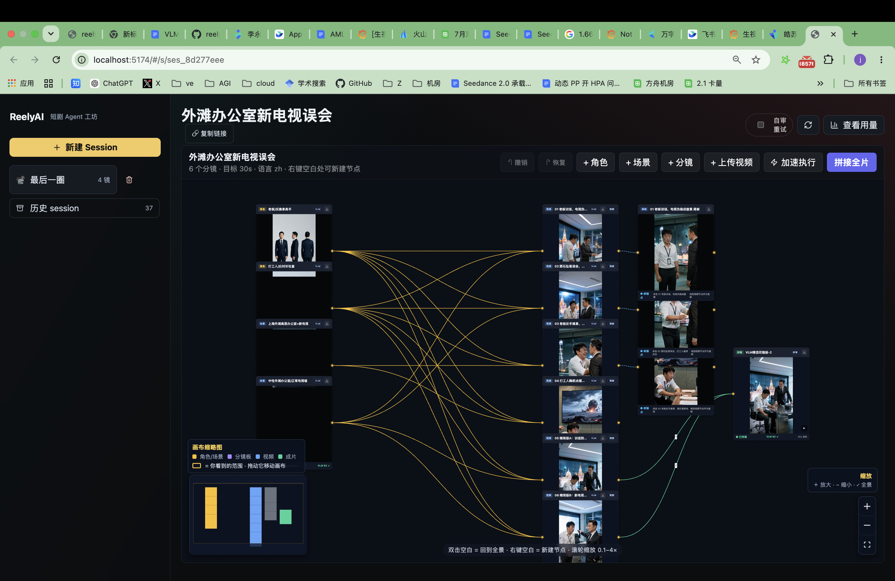
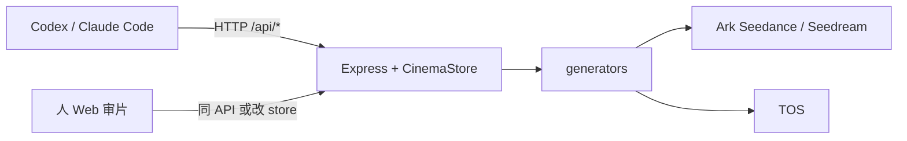

<div align="center">

**[中文](README.zh-CN.md)** | [English](README.md)

</div>

# reelyai-agent

**ReelyAI** 是一个面向 **1 分钟以上短片** 的制作 Agent：用 **Seedance 2.0** 做分镜视频，自动完成 **剧本规划 → 故事板 → 分镜生成 → 拼接**，端到端产出一条可播放的完整视频。

**本项目也是 [火山方舟 Agent Plan](https://www.volcengine.com/docs/82379/2366394?lang=zh) 的推荐落地场景。** 开通 Agent Plan 后，用一把专属 API Key 即可为 ReelyAI 提供 **Seedream 生图、Seedance 2.0 生视频、Seed / VLM 审片** 所需的模型额度；应用走 `/api/plan/v3` 专用路由，并在画布 **Usage** 面板按节点汇总消耗。

你和 Codex、Claude Code 或 Cursor Agent 聊创意即可开拍；本地 Web 工作台（`npm run dev`）同步展示剧本、资产、分镜进度与成片，方便随时审阅、改 prompt 或人工接管某一环。



---

## 推荐：火山方舟 Agent Plan

[Agent Plan 套餐概览（官方文档）](https://www.volcengine.com/docs/82379/2366394?lang=zh) 介绍的是火山引擎面向 **Agent 场景** 的订阅套餐。与 Coding Plan 主要覆盖编程 token 不同，Agent Plan 把 Agent 真正会用到的 **多模态模型 + Harness 工具链** 打包在一起，用 **Agent 燃料值（AFP）** 统一计量，更适合「对话 → 生图 → 生视频 → 审片 → 交付」这类长链路任务。

| Agent Plan 能力 | 在 ReelyAI 里的用途 |
| --- | --- |
| **Doubao-Seed** 文本模型 | 剧本规划、prompt 扩写、Agent 推理 |
| **Doubao-Seedream**（默认 `doubao-seedream-5.0-lite`） | 角色 / 场景 / 道具 / 故事板参考图 |
| **Doubao-Seedance 2.0** / **2.0-fast** | 多分镜短片视频生成 |
| **Harness**（联网搜索、Embedding 等） | Agent 侧检索、记忆与工具链，详见 [官方文档](https://www.volcengine.com/docs/82379/2366394?lang=zh) |

**我们推荐用 Agent Plan 为 ReelyAI 提供 Seedream / Seedance / Seed 系列模型的 token。** 相比分别开通多套按量 Ark Key，Agent Plan 更省心、成本更可预期；ReelyAI 已内置 Agent Plan 路由、默认模型映射和按节点用量统计，开箱即可在 Codex / Claude Code / Cursor 里跑完整产片流程。

**快速接入**

1. 阅读 [Agent Plan 套餐概览](https://www.volcengine.com/docs/82379/2366394?lang=zh)，在 [Agent Plan 活动页](https://www.volcengine.com/activity/agentplan) 选择并开通套餐。
2. 进入 [火山方舟控制台](https://console.volcengine.com/ark)，在 **API 密钥管理** 创建并复制 **Agent Plan 专属 API Key**。
3. 写入项目根目录 `.env` 并开启优先路由：

```bash
ARK_AGENT_PLAN_KEY=<你的 Agent Plan key>
REELYAI_USE_AGENT_PLAN=1
ARK_AGENT_PLAN_BASE=https://ark.cn-beijing.volces.com/api/plan/v3
SEEDREAM_AGENT_PLAN_MODEL=doubao-seedream-5.0-lite
SEEDANCE_AGENT_PLAN_MODEL=doubao-seedance-2-0-260128
SEEDANCE_AGENT_PLAN_FAST_MODEL=doubao-seedance-2-0-fast-260128
```

4. **另开 TOS** 对象存储，把本地 / Codex 故事板发布成 Seedance 可拉取的 `https://` URL。Agent Plan 覆盖模型 token，**不能替代** TOS AK/SK。

**相关文档**

- [Agent Plan 套餐概览](https://www.volcengine.com/docs/82379/2366394?lang=zh)
- [接入多模态生成模型](https://www.volcengine.com/docs/82379/2373738?lang=zh)
- 官方实践「用 Agent Plan 开发短视频网站」— ReelyAI 是其开源画布版落地

若 Agent Plan 暂不可用，可删除 `REELYAI_USE_AGENT_PLAN=1`，回退到普通 Ark Key（见下文 Phase A）。

---

## 人类用户：开通 Agent Plan 与 TOS

真实运行 ReelyAI 至少需要两类服务：

- **Agent Plan / Ark 模型 API**：让本地 Node 调 Seedream / Seedance / VLM。
- **TOS 对象存储**：把本地参考图、Codex 故事板发布成远端可访问的 `https://` URL；Seedance worker 不能读取本机 `/media/...` 或 localhost。

### 1. 开通 Agent Plan

> 套餐说明见官方文档：[Agent Plan 套餐概览](https://www.volcengine.com/docs/82379/2366394?lang=zh)

1. 访问 [火山方舟 Agent Plan](https://www.volcengine.com/activity/agentplan)，登录火山引擎账号；新账号先完成实名认证/企业认证。
2. 在 Agent Plan 页面选择并开通套餐（Small / Medium / Large 等，含 Seedream、Seedance 等多模态额度）。它是模型 API 套餐，不会自动替你开通 TOS。
3. 进入 [火山方舟控制台](https://console.volcengine.com/ark)，在 **API 密钥管理** 创建并复制 Agent Plan 专属 API Key。
4. 写入项目根目录 `.env`：

```bash
ARK_AGENT_PLAN_KEY=<你的 Agent Plan key>
REELYAI_USE_AGENT_PLAN=1
ARK_AGENT_PLAN_BASE=https://ark.cn-beijing.volces.com/api/plan/v3
SEEDREAM_AGENT_PLAN_MODEL=doubao-seedream-5.0-lite
# 可选：除非 Agent Plan 文档明确给出兼容的文本模型，否则留空；ReelyAI 会用本地模板扩写，
# 避免把 seed-2-0-pro-260328 这类标准文本模型发到 /plan 后 404。
SEED_PROMPT_AGENT_PLAN_MODEL=
PROMPT_REWRITE_AGENT_PLAN_MODEL=
AGENT_PLAN_TEXT_MODEL=
SEEDANCE_AGENT_PLAN_MODEL=doubao-seedance-2-0-260128
SEEDANCE_AGENT_PLAN_FAST_MODEL=doubao-seedance-2-0-fast-260128
```

如果 Agent Plan 暂时不可用，删除 `REELYAI_USE_AGENT_PLAN`，改用普通 Ark key：`BP_ARK_API_KEY` / `ARK_API_KEY`，并保持 `SEEDANCE_API_BASE`、`SEEDREAM_API_BASE` 与 key 所在区域一致。

### 2. 开通 TOS

1. 访问 [火山引擎 TOS 控制台](https://console.volcengine.com/tos)，首次进入按提示开通对象存储服务。
2. 在 **桶列表** 创建 Bucket：选择地域（例如 `cn-beijing`），桶名全局唯一；推荐先用 **私有** 桶。
3. 在火山引擎 **访问控制 / 访问密钥** 创建 AK/SK；生产环境建议用 IAM 子用户并授予该桶的 `PutObject`、`GetObject`、`ListBucket` 等最小权限。
4. 写入 `.env`：

```bash
TOS_ACCESS_KEY_ID=<AK>
TOS_SECRET_ACCESS_KEY=<SK>
TOS_REGION=cn-beijing
TOS_ENDPOINT=tos-cn-beijing.volces.com
TOS_BUCKET=<bucket>
TOS_KEY_PREFIX=cinema-agent/storyboards
TOS_PRESIGN_EXPIRES_SEC=604800
```

私有桶可不填 `TOS_PUBLIC_BASE_URL`，应用会生成预签名 URL。若你配置了公共读桶或 CDN，可填：

```bash
TOS_PUBLIC_BASE_URL=https://<你的 bucket 或 CDN 域名>
```

完成后运行：

```bash
npm run dev
curl -sS http://localhost:5173/api/state | head -c 200
```

之后在 Web 里点「故事板 TOS」，或让 Agent 调 `POST /api/sessions/:sessionId/storyboards/publish-tos` 验证上传。

---

## 部署到火山云公开网址

首版推荐 **单台火山云 ECS + Docker Compose 或 systemd/Caddy + 持久目录**，最快拿到公开 IP/域名。已有 ECS 后可直接运行 [deploy/deploy-to-ecs.sh](deploy/deploy-to-ecs.sh)；如果 ECS 拉 Docker Hub 镜像不稳定，可走 systemd/Caddy fallback；如果证书验证链路被 EIP 网络挡住，可先用 Cloudflare Quick Tunnel 拿 HTTPS 测试入口。完整部署手册见 [deploy/volcengine.md](deploy/volcengine.md)。

公开部署时不要把你的 `ARK_AGENT_PLAN_KEY` 写进服务器环境变量；用户在顶栏「配置 Agent Plan」输入自己的 token，后端只保存在 Node 进程内存里，不会写入 `/api/state` 或 `data/cinema-store.json`。TOS 仍使用服务器后台凭据，建议私有桶 + 预签名 URL。

当前首版公网入口为 `https://reelyai.app`。实际应用进程在火山 ECS 上运行，Vercel/Cloudflare 只负责 HTTPS 边缘代理。

---

## Agent 操作手册

> **本节读者**：Codex、Claude Code、Cursor Agent。  
> 人负责按 Phase A 在火山引擎开通服务并填写 `.env`、在 Web 审片；**产片由你通过 REST API 执行**（见 [AGENTS.md](AGENTS.md)）。

## 你必须遵守

1. **只调 API**，不要用浏览器自动化操作 Web（人可在 `http://localhost:5173` 审阅/改稿，与 API 共享 `data/cinema-store.json`）。
2. **先读完本文「初始化」**，缺凭证时**停止产片**，用下文「告诉用户」模板让人去火山引擎/console 开通；不要编造 key。
3. 安装并遵循项目 skills（单一源 `.agents/skills/` 为跨平台标准；`npm run install:skill` 自动分发到本机检测到的各 runtime——Codex/Claude/Cursor/agents）：`reelyai-shortdrama`、`reelyai-agent-session`、需要故事板时用 `reelyai-storyboard-imagegen`。
4. **远端 Seedance 只吃 `http(s)` 参考图**。本地 `/media/...` 必须先 `POST .../publish-tos` 或配置 `PUBLIC_MEDIA_BASE_URL`（不能是 localhost）。
5. Web 上的人工修改视为**当前真相**；继续前 `GET /api/state` 刷新。

```bash
BASE_URL="${REELYAI_AGENT_BASE_URL:-${CINEMA_AGENT_BASE_URL:-http://localhost:5173}}"
```

---

## 初始化（每次接手仓库先跑）

按顺序执行；任一步失败则修复后再往下。

| 步 | 你执行 | 通过条件 |
| --- | --- | --- |
| 1 | `npm install`（需要时 `npm run install:skill`） | 无报错；skills 镜像到检测到的 runtime（`~/.codex|.claude|.cursor|.agents/skills`）|
| 2 | 若无 `.env`：`cp .env.example .env` | 文件存在 |
| 3 | 读 `.env`，对照下表「凭证门闩」 | 见下文：缺则进入 **Phase A**，不调用 generate |
| 4 | 后台 `npm run dev` | `curl -sS "$BASE_URL/api/state"` 返回 JSON |
| 5 | 向用户报告 `BASE_URL` 与 Web 审片地址 | 人可在浏览器打开同一地址 |

**凭证门闩（真实出片最低要求）**

| 能力 | `.env` 变量 | 未配置时 |
| --- | --- | --- |
| **推荐** Agent Plan 统一路由 | `ARK_AGENT_PLAN_KEY` + `REELYAI_USE_AGENT_PLAN=1` | 见上文 [推荐：火山方舟 Agent Plan](#推荐火山方舟-agent-plan) |
| 分镜视频 Seedance（回退） | `BP_ARK_API_KEY` 或 `ARK_API_KEY` / `SEEDANCE_API_KEY` | 仅 mock 视频；**不得**声称已真实生成 |
| Codex/本地参考图进 Seedance | `TOS_*` **或** 非 localhost 的 `PUBLIC_MEDIA_BASE_URL` | 参考图不进 Seedance payload |
| 资产库 Seedream 生图（回退） | `SEEDREAM_API_KEY`、复用 Ark key | 资产图 mock；可用 Codex `imagegen` + `sketches/import` 替代 |

可选：`OPENAI_API_KEY`（剧本 `script/generate`）、`VOLC_TTS_*`（解说）、`SEEDANCE_API_URL`（自定义 endpoint）。

Agent Plan 走专属 `https://ark.cn-beijing.volces.com/api/plan/v3` base URL 和专属 key。默认不覆盖现有 key；设置 `REELYAI_USE_AGENT_PLAN=1` 才优先使用 `ARK_AGENT_PLAN_KEY`，取消该开关即可回到原来的 `.env` 体系。Agent Plan 模式下默认 Seedream 模型改用 `doubao-seedream-5.0-lite`，避免旧的 `seedream-4-5-251128` 被套餐拒绝。注意：`ARK_AGENT_PLAN_KEY` 不能替代 TOS AK/SK，也不能替代 OpenSpeech TTS 的 `VOLC_TTS_APPID` / `VOLC_TTS_TOKEN`。

无 key 时可跑通 UI/mock 流程做联调，但要在对话里标明 **mock 模式**。

---

## Phase A — 告诉用户：去火山引擎开什么（复制改写后发给人）

当 `.env` 缺门闩项时，**暂停产片**，把下面清单发给用户（可删减已完成的项）。等人填好 `.env` 后你再 `curl` 验证并进入 Phase B。

```markdown
### 请在火山引擎 / BytePlus 完成以下开通（ReelyAI Agent 需要）

#### 1. 方舟 Agent Plan — 推荐，用于 Seedream / Seedance / VLM（首选）
- 官方文档：[Agent Plan 套餐概览](https://www.volcengine.com/docs/82379/2366394?lang=zh)
- 开通：[Agent Plan 活动页](https://www.volcengine.com/activity/agentplan) → [火山方舟控制台](https://console.volcengine.com/ark) 创建 **Agent Plan 专属 API Key**
- 写入 `.env`：
  - `ARK_AGENT_PLAN_KEY=<你的 Agent Plan 专属 key>`
  - `REELYAI_USE_AGENT_PLAN=1`
  - `ARK_AGENT_PLAN_BASE=https://ark.cn-beijing.volces.com/api/plan/v3`
- ReelyAI 默认走 Agent Plan 模型：`doubao-seedream-5.0-lite`、`doubao-seedance-2-0-260128` / `doubao-seedance-2-0-fast-260128`
- 若不可用，删除 `REELYAI_USE_AGENT_PLAN` 后改用下方普通 Ark Key

#### 2. 方舟 Ark — API Key（回退，用于 Seedance 视频）
- 控制台：[火山引擎方舟](https://console.volcengine.com/ark) 或 [BytePlus ModelArk](https://console.byteplus.com/ark)（海外用 BytePlus，与 `.env` 里 `SEEDANCE_API_BASE` / `SEEDREAM_API_BASE` 区域一致）。
- 操作：创建 **API Key**，写入本机项目根目录 `.env`：
  - `BP_ARK_API_KEY=<你的 key>`（推荐）
  - 或 `ARK_API_KEY=<你的 key>`
- Agent Plan 试用路径：见上文 **§1 Agent Plan**；不成功时删除 `REELYAI_USE_AGENT_PLAN` 即回退到上述普通 Ark key。
- 确认账号已开通 **Seedance 2.0** 视频生成（默认模型 id：`dreamina-seedance-2-0-260128`，fast：`dreamina-seedance-2-0-fast-260128`）。
- 国内方舟 base 常为 `https://ark.cn-beijing.volces.com/api/v3`；BytePlus 东南亚示例见 `.env.example` 的 `https://ark.ap-southeast.bytepluses.com/api/v3`。区域必须与 key 匹配。

#### 3. 方舟 Ark — Seedream 生图（回退，用于角色/场景资产）
- 同一 Ark API Key 通常可复用；在 `.env` 设 `SEEDREAM_API_KEY` 或留空让它回退到 `BP_ARK_API_KEY`。
- 确认已开通 **Seedream 4.5**（`seedream-4-5-251128`）或 4.0（`seedream-4-0-250828`）。

#### 4. 对象存储 TOS（必需，若要用参考图 / Codex 故事板驱动 Seedance）
- 控制台：[火山引擎 TOS](https://console.volcengine.com/tos)。
- 操作：创建 **Bucket**（记下地域），创建 **访问密钥** AK/SK。
- 写入 `.env`：
  - `TOS_ACCESS_KEY_ID` / `TOS_SECRET_ACCESS_KEY`
  - `TOS_REGION`（如 `cn-beijing`）
  - `TOS_ENDPOINT`（如 `tos-cn-beijing.volces.com`）
  - `TOS_BUCKET=<桶名>`
  - `TOS_KEY_PREFIX=cinema-agent/storyboards`（可改）
- 私有桶：可不填 `TOS_PUBLIC_BASE_URL`，应用会上传并写 **预签名 URL**（默认 7 天）。
- 公开桶/CDN：填 `TOS_PUBLIC_BASE_URL` 为对象公网根地址。

**替代**：若暂不开 TOS，需把本机 `npm run dev` 通过 **公网隧道** 暴露，并设 `PUBLIC_MEDIA_BASE_URL=https://<隧道域名>`（禁止 localhost）。

#### 5. 可选 — OpenAI（剧本自动扩写 / GPT Image 2）
- `OPENAI_API_KEY` 或 `OAI_KEY`；`OPENAI_IMAGE_MODEL=gpt-image-2`。
- 注意：**Codex 内置 imagegen ≠ 本应用的 OpenAI 调用**；Codex 出图后仍要走 `POST /api/shots/:shotId/sketches/import`。

#### 6. 可选 — 豆包语音 OpenSpeech（自动解说+字幕）
- 文档：<https://www.volcengine.com/docs/6561/1598757>
- `.env`：`VOLC_TTS_APPID`、`VOLC_TTS_TOKEN`；默认 `VOLC_TTS_RESOURCE_ID=seed-tts-1.0`。

#### 7. 本地运行（用户机器）
- Node.js（建议 22）、`npm install`、`npm run dev`。
- ffmpeg 已由依赖 bundled；字幕字体见 `.env.example` 的 `NARRATION_SUBTITLE_*`（macOS 默认可用）。

完成后请保存 `.env` 并告知 Agent 继续；Agent 会重启或确认 `npm run dev` 已跑，再请求 `/api/state`。
```

**你验证配置是否生效**

```bash
# 服务存活
curl -sS "$BASE_URL/api/state" | head -c 200

# 有 Ark key 时，后续第一次 POST .../shots/:id/generate 不应因「未配置」立刻 500
# 有 TOS 时，对本地草图：POST /api/shots/:shotId/sketches/publish-tos 或 POST /api/sessions/:id/storyboards/publish-tos
```

---

## Phase B — 产片流水线（API）

默认 **分阶段确认**：`script/generate` 和 `storyboard` 之后暂停，让人在 Web 改剧本/分镜；用户说继续再 `generate` / `stitch`。用户明确要求全自动时可跳过暂停，但仍要给出 `BASE_URL` 供抽查。

| 序 | 动作 | API / 说明 |
| --- | --- | --- |
| 1 | 建 session | `POST /api/sessions` — `title`, `logline`, `style`, `targetDurationSec`, `shotCount`（单镜 ≤15s，镜数 ≥ `ceil(总时长/15)`） |
| 2 | 生成剧本 | `POST /api/sessions/:id/script/generate` → **暂停**，让人审 `story` |
| 3 | 资产 | `GET /api/state` 复用 assets；缺则 `POST /api/assets` + `POST /api/assets/:id/generate`（`seedream-4-5`）；prompt 用 `@资产名` |
| 4 | 故事板 | Codex `imagegen` 或 skill `reelyai-storyboard-imagegen` → `POST /api/shots/:shotId/sketches/import` → **publish-tos** |
| 5 | 分镜表 | `POST /api/sessions/:id/storyboard` → **暂停**，让人改 shot `rawPrompt` / 秒数 |
| 6 | 出视频 | 镜 2+：`PATCH /api/shots/:id` `usePreviousShotClip:true`, `previousShotClipSec:2`；然后 `POST /api/shots/:id/generate` → `POST .../poll` 直到 `ready`；**串行**保连续性 |
| 7 | 拼接 | 全部 `ready` → `POST /api/sessions/:id/stitch` → `POST .../stitch/poll` 直到 `stitchStatus=ready` |
| 8 | 交付 | 回报 `GET /api/sessions/:id/download` 与 Web 上的成片 |

**首帧模式（仅 shot 1 且用户明确要求）**：`PATCH` 设 `firstFrameAssetId`；资产 `mediaUrl` 必须是 `https://`；与 `reference_image` 互斥，服务端会剥离其它参考媒体。

**关键端点**（完整 curl 见 `.agents/skills/reelyai-agent-session/reference.md`）：

- `GET /api/state`
- `POST /api/sessions/:sessionId/script/generate`
- `POST /api/sessions/:sessionId/storyboard`
- `POST /api/shots/:shotId/generate` · `POST /api/shots/:shotId/poll`
- `POST /api/sessions/:sessionId/storyboards/publish-tos`
- `POST /api/sessions/:sessionId/stitch` · `POST /api/sessions/:sessionId/stitch/poll`

## 架构（单页）



- 你的对话模型：规划、写 prompt、决定调哪些 API。
- **视频 / 应用内 Seedream**：`POST /api/*` 后由 **本机 Node** 调 Ark，不是由你直连 Seedance。
- Codex `imagegen`：你在 agent 环境出图 → `sketches/import` → TOS → 再 `generate`。

## 数据与 mock

- 状态文件：`data/cinema-store.json`（`assets` / `sessions` / `shots`）。
- 无 Ark key：mock 媒体 URL，用于流程演练；**对外说明是 mock**。

## 更多规则

- [AGENTS.md](AGENTS.md) — 媒体、TOS、串行、拼接门闩  
- [docs/agent-workflow.md](docs/agent-workflow.md) — 角色分工与 image provider 形状  
- [.agents/skills/reelyai-shortdrama/SKILL.md](.agents/skills/reelyai-shortdrama/SKILL.md) — 端到端短剧 skill  

## 人做什么（极简）

人通常不直接调 API；人 **按 Phase A 开通火山引擎并填 `.env`**，在 Web **审阅/改** 剧本、分镜与资产，必要时手动触发生成或拼接。你把 `BASE_URL` 和当前 session 标题发给人即可。
