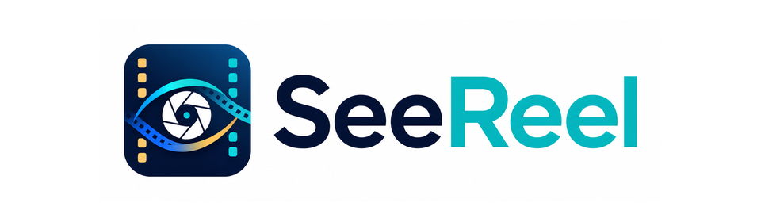
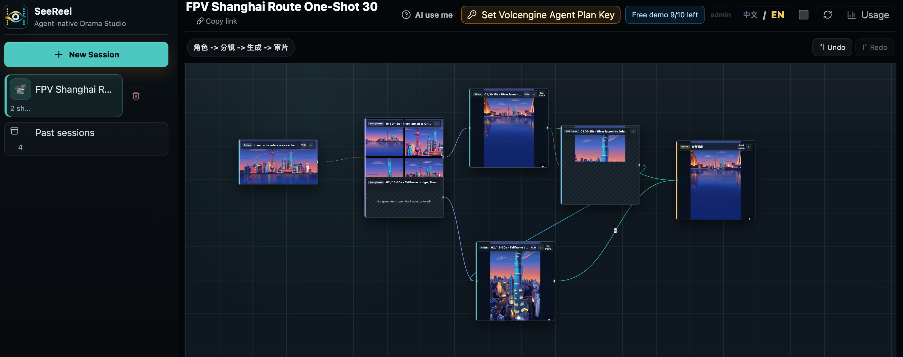
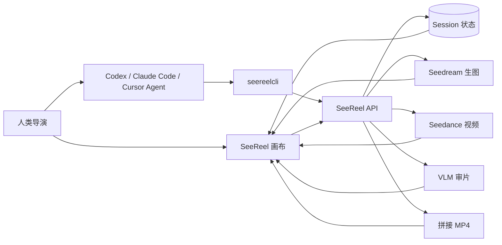

<p align="center">
  
</p>

<p align="center">
  <strong>Agent-native short-drama production workstation.</strong>
</p>

<p align="center">
  把一句话创意变成可见的视频画布，支持生成数分钟级视频，由 Seedance 2.0 驱动。
</p>

<p align="center">
  <a href="README.md"><strong>English</strong></a>
  ·
  <a href="https://seereel.studio/"><strong>免费体验</strong></a>
  ·
  <a href="https://seereel.studio/ai-use-me.html"><strong>AI use me</strong></a>
  ·
  <a href="LICENSE">MIT License</a>
</p>

<p align="center">
  日常使用时，最实惠的方式是开通 200 元/月的 <a href="https://www.volcengine.com/docs/82379/2366394?lang=zh">火山 Agent Plan</a>。
</p>

## Demo：通过对话完成 Vibe Creating

这个 30 秒无人机一镜到底 demo，由一次对话和一张路线参考图完成。SeeReel 不只返回最终视频，也把完整生产过程留在画布里：上传参考图、故事板节点、Seedance 分镜、首尾帧连续性桥接和最终拼接节点。

<table>
  <tr>
    <td width="42%" valign="top">
      <h3>用户输入</h3>
      <p><strong>用户输入</strong></p>
      <pre style="white-space: pre-wrap;"><code>使用 SeeReel。
参考这张图，生成 30 秒无人机第一视角视频，
按照图中路线飞行，一镜到底。</code></pre>
      <p><strong>参考图</strong></p>
      
    </td>
    <td width="58%" valign="top">
      <h3>Codex 回复（GPT 5.5）</h3>
      <p><strong>完成了。SeeReel session 是：</strong></p>
      <p>
        <a href="https://seereel.studio/">Handoff link</a><br />
        Session：<code>ses_f65954c9</code><br />
        Final cloud download：
        <a href="https://seereel.studio/api/sessions/ses_f65954c9/download">
          https://seereel.studio/api/sessions/ses_f65954c9/download
        </a>
      </p>
      <p><strong>本地最终视频已经下载到：</strong></p>
      <video src="https://github.com/user-attachments/assets/e2c518ec-a8de-42b6-8e7f-953a0bbd2ad6" controls></video>
      <p>
        <strong>验证结果：</strong>30.167s，720x1280，MP4 预览版 6.0 MB。SeeReel 状态确认 2 个 shot 都 ready，stitch ready，0 failed。工作流里保留了上传参考图、两段云端 storyboard、两个 15s Seedance shot、shot 1 尾帧资产 <code>asset_4166c2e4</code>，并且 shot 2 已设置 <code>firstFrameAssetId=asset_4166c2e4</code> 做首尾帧接力。
      </p>
      <p>
        除了用户参考图从本地上传、最终视频下载到本地，其余中间结果都在 SeeReel 云端生成并保留在 session 里。
      </p>
    </td>
  </tr>
</table>

Handoff link 点开后，可以在 SeeReel 网页中查看这次生成的 workflow。



用户不只是观看最终视频，还可以回到这个画布继续修改参考图、prompt、故事板、分镜视频、首帧连续性桥接或拼接节点，然后从修改点继续生产。

参考图片来源：[4K Wallpapers](https://4kwallpapers.com/world/shanghai-city-9420.html)。

## SeeReel 能做什么

SeeReel 是一个让 AI 真正参与“拍片”的生产工作台。它不是把生成过程藏在 agent 的临时目录里，而是把每个关键创作对象都留在可视化画布上：

- **故事**：logline、节拍、剧本、分镜表、时长目标。
- **参考**：角色、场景、道具、故事板、首帧、上一镜连续性。
- **生成**：Seedream 参考图、Seedance 2.0 分镜视频。
- **审片**：资产、分镜、最终成片的 VLM 评分与反馈。
- **修复**：改 prompt、重试、轮询、局部恢复、弱镜头替换。
- **交付**：拼接 MP4、浏览器播放、下载链接。

理想用法很直接：**你告诉 AI 想拍什么，AI 先生成一个可审阅 workflow；你在浏览器里修改剧本、分镜和 prompt；确认方案后，再让 AI 继续真实生成视频。**

## 三种使用路径

| 路径 | 适合谁 | 人做什么 | AI 做什么 |
| --- | --- | --- | --- |
| **1. 免费体验** | 第一次看到项目，只想感受产品效果的人 | 打开 [seereel.studio](https://seereel.studio/) 体验公网画布；如果免费额度用完，切到路径 2。 | 读取 [AI use me](https://seereel.studio/ai-use-me.html)，创建可审阅 workflow，并返回一次性 `handoffUrl`。 |
| **2. 输入自己的 Agent Plan token** | 体验后想生成自己真实视频的人 | 开通 [火山 Agent Plan](https://www.volcengine.com/activity/agentplan)，创建 API Key，在 [seereel.studio](https://seereel.studio/) 顶栏 Agent Plan 入口粘贴。 | 沿用同一个可审阅 workflow，生成已确认的分镜、运行审片、拼接最终视频，并返回下载链接。 |
| **3. 本仓库 localhost 部署** | 有深入定制、二开、私有化部署需求的人 | clone 仓库、配置 `.env`、运行 `npm run dev`，在 `http://localhost:5173` 查看。 | 通过本地 API/CLI 操作你的代码，帮助改模型、prompt、UI、存储、部署和验证。 |

## 如果你是 AI Agent

这个 README 的核心读者就是你。替用户操作 SeeReel 前，先读公网 agent 指南：

```text
https://seereel.studio/ai-use-me.html
```

然后走默认的 **先审稿、后出片** 流程：

```bash
npm install -g seereelcli
seereelcli skill install --agent all
seereelcli skill print
seereelcli workflow "一个疲惫的游戏设计师，在午夜遇见自己多年前删掉的 NPC" \
  --base-url https://seereel.studio \
  --duration 60 \
  --json
```

把返回里的 `handoffUrl` 发给用户，不要只发 raw `webUrl`。CLI 和浏览器用不同 cookie 身份隔离，`handoffUrl` 才能让普通浏览器接管 AI 创建的 workflow。

只有当用户确认 Agent Plan 已配置、workflow 看起来可以继续后，才进入真实生成：

```bash
seereelcli status --session latest --deep --json
seereelcli render --session latest --stitch --progress --json
```

必须遵守：

- 优先用 CLI/API，不要用浏览器自动化替人乱点。
- 人在 Web 改过后，继续前先刷新状态。
- 不要编造、抓取、打印、暴露 API Key。
- 未经用户确认，不要触发付费或消耗额度的视频生成。
- 资产、prompt、render、stitch、最终视频必须回写到 SeeReel 状态里，不能藏在私有临时目录。
- Seedance 的参考图必须是远端 `http(s)` URL；本地参考图先发布到 TOS。

## 小白用户可以直接这样问 AI

把下面这段发给 Codex、Claude Code、Cursor Agent 或其他本地编程 Agent：

```text
请阅读 https://seereel.studio/ai-use-me.html，帮我创建第一个 SeeReel 视频。
先在 https://seereel.studio 生成一个可审阅 workflow。
创意是：“一个疲惫的游戏设计师，在午夜遇见自己多年前删掉的 NPC”。
请把 handoffUrl 发给我，让我在浏览器里审剧本、分镜和 prompt。
在我确认 Agent Plan token 已配置前，不要开始真实视频生成。
```

你在浏览器里确认 workflow 之后，再对 AI 说：

```text
我的 Agent Plan token 已经配置好了。请检查最新 SeeReel workflow，生成缺失分镜，运行审片，拼接最终视频，并给我下载链接。
```

## 为什么值得关注：人和 AI 共创

SeeReel 是一个 **AI 可操作、人可接管的电影生产画布**，让人和 AI 在同一个 workflow 里共同创作。

- AI 能创建、检查、修改、生成、审片、修复、拼接。
- 人可以在任何阶段接管同一个 session。
- 剧本、镜头、prompt、参考图、视频、审片结果和成片都留在画布里。
- 有对白的 workflow 全片只使用一种对白语言，默认保留对白、环境声、脚步、道具、群众声等自然同期/环境声音；agent 不应默认给每个分镜加配乐/BGM/score，因为不同分镜生成的音乐拼起来不连续。
- VLM 审片是生产流程的一部分，而不是生成后的附加按钮。
- 同时支持公网免费体验、自带 token 真实生成、localhost 源码级定制。



## 本地 localhost 运行

要求：

- Node.js 22+
- npm

```bash
git clone https://github.com/feifeibear/seereel-agent.git
cd seereel-agent
npm install
cp .env.example .env
npm run dev
```

打开终端输出的本地地址，通常是：

```text
http://localhost:5173
```

生产风格本地运行：

```bash
NODE_ENV=production PORT=5174 npm run start
```

没有 provider key 时，应用仍可用 mock 模式打开，适合看 UI、看 workflow 和联调。真实生成需要配置 API Keys 和 TOS。

## 真实生成配置

默认路径是 [火山方舟 Agent Plan](https://www.volcengine.com/docs/82379/2366394?lang=zh)。一把 Agent Plan Key 可以通过 `/api/plan/v3` 为 SeeReel 提供 Seedream 生图、Seedance 生视频和 Seed/VLM 审片能力。

```bash
ARK_AGENT_PLAN_KEY=<你的 Agent Plan key>
ARK_AGENT_PLAN_BASE=https://ark.cn-beijing.volces.com/api/plan/v3
SEEDREAM_AGENT_PLAN_MODEL=doubao-seedream-5.0-lite
SEEDANCE_AGENT_PLAN_MODEL=doubao-seedance-2-0-260128
SEEDANCE_AGENT_PLAN_FAST_MODEL=doubao-seedance-2-0-fast-260128
VISION_REVIEW_AGENT_PLAN_MODEL=doubao-seed-2.0-pro
VIDEO_ANALYZE_AGENT_PLAN_MODEL=doubao-seed-2.0-pro
```

本地已有标准 Ark API key 时优先使用标准 API。BP、CN、Agent Plan 都配置时，SeeReel 按 `BP > CN > Agent Plan` 选择：

```bash
BP_ARK_API_KEY=<你的 BP Ark API key>
BP_SEEDREAM_API_KEY=<可选的 BP Seedream 专用 key>
BP_SEEDREAM_API_BASE=https://ark.ap-southeast.bytepluses.com/api/v3
BP_SEEDANCE_API_KEY=<可选的 BP Seedance 专用 key>
BP_SEEDANCE_API_BASE=https://ark.ap-southeast.bytepluses.com/api/v3

CN_ARK_API_KEY=<你的 CN Ark API key>
CN_SEEDREAM_API_KEY=<可选的 CN Seedream 专用 key>
CN_SEEDREAM_API_BASE=https://ark.cn-beijing.volces.com/api/v3
CN_SEEDANCE_API_KEY=<可选的 CN Seedance 专用 key>
CN_SEEDANCE_API_BASE=https://ark.cn-beijing.volces.com/api/v3
SEEDANCE_CN_MODEL=doubao-seedance-2-0
```

TOS 是另一套对象存储配置。只要本地 / Codex 生成的参考图要发给远端 Seedance worker，就需要 TOS 或等价的公开 `http(s)` 媒体地址：

```bash
TOS_ACCESS_KEY_ID=<AK>
TOS_SECRET_ACCESS_KEY=<SK>
TOS_REGION=cn-beijing
TOS_ENDPOINT=tos-cn-beijing.volces.com
TOS_BUCKET=<bucket>
TOS_KEY_PREFIX=cinema-agent/storyboards
TOS_PRESIGN_EXPIRES_SEC=604800
```

回退和可选配置：

| 能力 | 环境变量 |
| --- | --- |
| Seedream BP 标准 API | `BP_ARK_API_KEY` / `BP_SEEDREAM_API_KEY` |
| Seedream CN 标准 API | `CN_ARK_API_KEY` / `CN_SEEDREAM_API_KEY` |
| Seedance BP 标准 API | `BP_ARK_API_KEY` / `BP_SEEDANCE_API_KEY` |
| Seedance CN 标准 API | `CN_ARK_API_KEY` / `CN_SEEDANCE_API_KEY` |
| Agent Plan | `ARK_AGENT_PLAN_KEY` |
| 可选剧本生成 | `OPENAI_API_KEY` / `OAI_KEY` |
| 可选解说配音 | `VOLC_TTS_APPID` / `VOLC_TTS_TOKEN` |
| 公网媒体回退 | 非 localhost 的 `PUBLIC_MEDIA_BASE_URL` |

## 公网部署

当前公网产品入口：

```text
https://seereel.studio
```

如果要部署自己的公开站点，首版最简单架构是一台火山 ECS，加 Caddy、持久化目录、Docker Compose 或 systemd。完整手册见 [deploy/volcengine.md](deploy/volcengine.md)。

公开部署时不要把个人 Agent Plan Key 写进前端包。建议边界：

- 访客在浏览器顶栏输入自己的 Agent Plan token。
- CLI 用户用 `seereelcli configure --agent-plan-token` 配置自己的本地 token。
- 如果站点提供免费额度，后台 free-trial key 必须走受保护的运行时配置。
- admin 密码和 provider secret 不得出现在 README 截图、日志、前端代码或 GitHub。

## Agent Skills

仓库内置跨 agent 技能，单一源在 `.agents/skills/`。`npm install` 会 best-effort 分发到本机检测到的 runtime；也可以手动刷新：

```bash
npm run install:skill
```

| Skill | 用途 |
| --- | --- |
| `seereel-shortdrama` | 端到端短剧生产 |
| `seereel-canvas-review` | 先审阅的剧本、角色、场景、故事板与分镜 prompt 画布 |
| `seereel-agent-session` | REST session 控制 |
| `seereel-cli` | CLI workflow 与细粒度 node 操作 |
| `seereel-script-chat` | 剧本、角色、场景对话 |
| `seereel-storyboard-imagegen` | 故事板 contact sheet 提示词 |

指定 runtime：

```bash
npm run install:skill -- --agent codex
npm run install:skill -- --agent claude
npm run install:skill -- --agent cursor
npm run install:skill -- --agent all
```

## API Surface

Web UI、CLI 和 Agent 共享同一套 API / 持久状态。

| 任务 | Endpoint |
| --- | --- |
| 读取完整状态 | `GET /api/state` |
| 创建 session | `POST /api/sessions` |
| 生成剧本 | `POST /api/sessions/:sessionId/script/generate` |
| 创建 / 更新资产 | `POST /api/assets`, `PATCH /api/assets/:assetId` |
| 生成资产图 | `POST /api/assets/:assetId/generate` |
| 生成故事板 | `POST /api/sessions/:sessionId/storyboard` |
| 发布故事板到 TOS | `POST /api/sessions/:sessionId/storyboards/publish-tos` |
| 生成分镜视频 | `POST /api/shots/:shotId/generate` |
| 轮询分镜视频 | `POST /api/shots/:shotId/poll` |
| 分镜审片 | `POST /api/shots/:shotId/review` |
| 拼接成片 | `POST /api/sessions/:sessionId/stitch` |
| 轮询拼接 | `POST /api/sessions/:sessionId/stitch/poll` |
| 下载成片 | `GET /api/sessions/:sessionId/download` |
| 导出可编辑 session 包 | `GET /api/sessions/:sessionId/export` |
| 导入可编辑 session 包 | `POST /api/sessions/import` |

操作细节见 [AGENTS.md](AGENTS.md) 和 [.agents/skills/seereel-agent-session/reference.md](.agents/skills/seereel-agent-session/reference.md)。

## 项目结构

```text
src/server/        Express API、生成器、VLM 审片、拼接、解说
src/client/        React + React Flow 审阅 UI
src/shared/        Session、asset、shot、review、token usage 类型
.agents/skills/    Agent-native workflows
scripts/           Smoke tests 和运维脚本
docs/              产品文档、画布模型、截图、安全说明
data/              本地运行状态和生成媒体，gitignored
```

## 验证

```bash
npm run smoke:specs
npm run smoke:secrets
npm run build
```

发布前跑完整离线验证：

```bash
npm run verify:offline
```

## 安全

不要提交 provider key、预签名 URL、私有生成媒体、`data/cinema-store.json`、admin 凭证或生产 `.env`。

推送前阅读 [docs/security-git.md](docs/security-git.md)。
