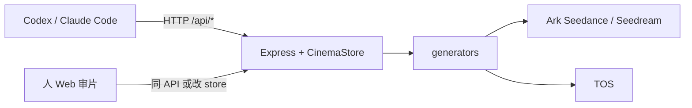

<div align="center">

**[中文](README.zh-CN.md)** | [English](README.md)

</div>

# reelyai-agent

**ReelyAI** 是一个面向 **1 分钟以上短片** 的制作 Agent：用 **Seedance 2.0** 做分镜视频，自动完成 **剧本规划 → 故事板 → 分镜生成 → 拼接**，端到端产出一条可播放的完整视频。

你和 Codex、Claude Code 或 Cursor Agent 聊创意即可开拍；本地 Web 工作台（`npm run dev`）同步展示剧本、资产、分镜进度与成片，方便随时审阅、改 prompt 或人工接管某一环。

---

## Agent 操作手册

> **本节读者**：Codex、Claude Code、Cursor Agent。  
> 人负责按 Phase A 在火山引擎开通服务并填写 `.env`、在 Web 审片；**产片由你通过 REST API 执行**（见 [AGENTS.md](AGENTS.md)）。

## 你必须遵守

1. **只调 API**，不要用浏览器自动化操作 Web（人可在 `http://localhost:5173` 审阅/改稿，与 API 共享 `data/cinema-store.json`）。
2. **先读完本文「初始化」**，缺凭证时**停止产片**，用下文「告诉用户」模板让人去火山引擎/console 开通；不要编造 key。
3. 安装并遵循项目 skills：`reelyai-shortdrama`、`.cursor/skills/reelyai-agent-session`（或 `~/.codex/skills` 里的同名 skill）、需要故事板时用 `reelyai-storyboard-imagegen`。
4. **远端 Seedance 只吃 `http(s)` 参考图**。本地 `/media/...` 必须先 `POST .../publish-tos` 或配置 `PUBLIC_MEDIA_BASE_URL`（不能是 localhost）。
5. Web 上的人工修改视为**当前真相**；继续前 `GET /api/state` 刷新。

```bash
BASE_URL="${REELYAI_AGENT_BASE_URL:-${CINEMA_AGENT_BASE_URL:-http://localhost:5173}}"
```

---

## 初始化（每次接手仓库先跑）

按顺序执行；任一步失败则修复后再往下。

| 步 | 你执行 | 通过条件 |
| --- | --- | --- |
| 1 | `npm install`（需要时 `npm run install:skill`） | 无报错；skills 写入 `~/.codex/skills` 等 |
| 2 | 若无 `.env`：`cp .env.example .env` | 文件存在 |
| 3 | 读 `.env`，对照下表「凭证门闩」 | 见下文：缺则进入 **Phase A**，不调用 generate |
| 4 | 后台 `npm run dev` | `curl -sS "$BASE_URL/api/state"` 返回 JSON |
| 5 | 向用户报告 `BASE_URL` 与 Web 审片地址 | 人可在浏览器打开同一地址 |

**凭证门闩（真实出片最低要求）**

| 能力 | `.env` 变量 | 未配置时 |
| --- | --- | --- |
| 分镜视频 Seedance | `BP_ARK_API_KEY` 或 `ARK_API_KEY` / `SEEDANCE_API_KEY` | 仅 mock 视频；**不得**声称已真实生成 |
| Codex/本地参考图进 Seedance | `TOS_*` **或** 非 localhost 的 `PUBLIC_MEDIA_BASE_URL` | 参考图不进 Seedance payload |
| 资产库 Seedream 生图 | `SEEDREAM_API_KEY` 或复用 Ark key | 资产图 mock；可用 Codex `imagegen` + `sketches/import` 替代 |

可选：`OPENAI_API_KEY`（剧本 `script/generate`）、`VOLC_TTS_*`（解说）、`SEEDANCE_API_URL`（自定义 endpoint）。

无 key 时可跑通 UI/mock 流程做联调，但要在对话里标明 **mock 模式**。

---

## Phase A — 告诉用户：去火山引擎开什么（复制改写后发给人）

当 `.env` 缺门闩项时，**暂停产片**，把下面清单发给用户（可删减已完成的项）。等人填好 `.env` 后你再 `curl` 验证并进入 Phase B。

```markdown
### 请在火山引擎 / BytePlus 完成以下开通（ReelyAI Agent 需要）

#### 1. 方舟 Ark — API Key（必需，用于 Seedance 视频）
- 控制台：[火山引擎方舟](https://console.volcengine.com/ark) 或 [BytePlus ModelArk](https://console.byteplus.com/ark)（海外用 BytePlus，与 `.env` 里 `SEEDANCE_API_BASE` / `SEEDREAM_API_BASE` 区域一致）。
- 操作：创建 **API Key**，写入本机项目根目录 `.env`：
  - `BP_ARK_API_KEY=<你的 key>`（推荐）
  - 或 `ARK_API_KEY=<你的 key>`
- 确认账号已开通 **Seedance 2.0** 视频生成（默认模型 id：`dreamina-seedance-2-0-260128`，fast：`dreamina-seedance-2-0-fast-260128`）。
- 国内方舟 base 常为 `https://ark.cn-beijing.volces.com/api/v3`；BytePlus 东南亚示例见 `.env.example` 的 `https://ark.ap-southeast.bytepluses.com/api/v3`。区域必须与 key 匹配。

#### 2. 方舟 Ark — Seedream 生图（推荐，用于角色/场景资产）
- 同一 Ark API Key 通常可复用；在 `.env` 设 `SEEDREAM_API_KEY` 或留空让它回退到 `BP_ARK_API_KEY`。
- 确认已开通 **Seedream 4.5**（`seedream-4-5-251128`）或 4.0（`seedream-4-0-250828`）。

#### 3. 对象存储 TOS（必需，若要用参考图 / Codex 故事板驱动 Seedance）
- 控制台：[火山引擎 TOS](https://console.volcengine.com/tos)。
- 操作：创建 **Bucket**（记下地域），创建 **访问密钥** AK/SK。
- 写入 `.env`：
  - `TOS_ACCESS_KEY_ID` / `TOS_SECRET_ACCESS_KEY`
  - `TOS_REGION`（如 `cn-beijing`）
  - `TOS_ENDPOINT`（如 `tos-cn-beijing.volces.com`）
  - `TOS_BUCKET=<桶名>`
  - `TOS_KEY_PREFIX=cinema-agent/storyboards`（可改）
- 私有桶：可不填 `TOS_PUBLIC_BASE_URL`，应用会上传并写 **预签名 URL**（默认 7 天）。
- 公开桶/CDN：填 `TOS_PUBLIC_BASE_URL` 为对象公网根地址。

**替代**：若暂不开 TOS，需把本机 `npm run dev` 通过 **公网隧道** 暴露，并设 `PUBLIC_MEDIA_BASE_URL=https://<隧道域名>`（禁止 localhost）。

#### 4. 可选 — OpenAI（剧本自动扩写 / GPT Image 2）
- `OPENAI_API_KEY` 或 `OAI_KEY`；`OPENAI_IMAGE_MODEL=gpt-image-2`。
- 注意：**Codex 内置 imagegen ≠ 本应用的 OpenAI 调用**；Codex 出图后仍要走 `POST /api/shots/:shotId/sketches/import`。

#### 5. 可选 — 豆包语音 OpenSpeech（自动解说+字幕）
- 文档：<https://www.volcengine.com/docs/6561/1598757>
- `.env`：`VOLC_TTS_APPID`、`VOLC_TTS_TOKEN`；默认 `VOLC_TTS_RESOURCE_ID=seed-tts-1.0`。

#### 6. 本地运行（用户机器）
- Node.js（建议 22）、`npm install`、`npm run dev`。
- ffmpeg 已由依赖 bundled；字幕字体见 `.env.example` 的 `NARRATION_SUBTITLE_*`（macOS 默认可用）。

完成后请保存 `.env` 并告知 Agent 继续；Agent 会重启或确认 `npm run dev` 已跑，再请求 `/api/state`。
```

**你验证配置是否生效**

```bash
# 服务存活
curl -sS "$BASE_URL/api/state" | head -c 200

# 有 Ark key 时，后续第一次 POST .../shots/:id/generate 不应因「未配置」立刻 500
# 有 TOS 时，对本地草图：POST /api/shots/:shotId/sketches/publish-tos 或 POST /api/sessions/:id/storyboards/publish-tos
```

---

## Phase B — 产片流水线（API）

默认 **分阶段确认**：`script/generate` 和 `storyboard` 之后暂停，让人在 Web 改剧本/分镜；用户说继续再 `generate` / `stitch`。用户明确要求全自动时可跳过暂停，但仍要给出 `BASE_URL` 供抽查。

| 序 | 动作 | API / 说明 |
| --- | --- | --- |
| 1 | 建 session | `POST /api/sessions` — `title`, `logline`, `style`, `targetDurationSec`, `shotCount`（单镜 ≤15s，镜数 ≥ `ceil(总时长/15)`） |
| 2 | 生成剧本 | `POST /api/sessions/:id/script/generate` → **暂停**，让人审 `story` |
| 3 | 资产 | `GET /api/state` 复用 assets；缺则 `POST /api/assets` + `POST /api/assets/:id/generate`（`seedream-4-5`）；prompt 用 `@资产名` |
| 4 | 故事板 | Codex `imagegen` 或 skill `reelyai-storyboard-imagegen` → `POST /api/shots/:shotId/sketches/import` → **publish-tos** |
| 5 | 分镜表 | `POST /api/sessions/:id/storyboard` → **暂停**，让人改 shot `rawPrompt` / 秒数 |
| 6 | 出视频 | 镜 2+：`PATCH /api/shots/:id` `usePreviousShotClip:true`, `previousShotClipSec:2`；然后 `POST /api/shots/:id/generate` → `POST .../poll` 直到 `ready`；**串行**保连续性 |
| 7 | 拼接 | 全部 `ready` → `POST /api/sessions/:id/stitch` → `POST .../stitch/poll` 直到 `stitchStatus=ready` |
| 8 | 交付 | 回报 `GET /api/sessions/:id/download` 与 Web 上的成片 |

**首帧模式（仅 shot 1 且用户明确要求）**：`PATCH` 设 `firstFrameAssetId`；资产 `mediaUrl` 必须是 `https://`；与 `reference_image` 互斥，服务端会剥离其它参考媒体。

**关键端点**（完整 curl 见 `.cursor/skills/reelyai-agent-session/reference.md`）：

- `GET /api/state`
- `POST /api/sessions/:sessionId/script/generate`
- `POST /api/sessions/:sessionId/storyboard`
- `POST /api/shots/:shotId/generate` · `POST /api/shots/:shotId/poll`
- `POST /api/sessions/:sessionId/storyboards/publish-tos`
- `POST /api/sessions/:sessionId/stitch` · `POST /api/sessions/:sessionId/stitch/poll`

## 架构（单页）



- 你的对话模型：规划、写 prompt、决定调哪些 API。
- **视频 / 应用内 Seedream**：`POST /api/*` 后由 **本机 Node** 调 Ark，不是由你直连 Seedance。
- Codex `imagegen`：你在 agent 环境出图 → `sketches/import` → TOS → 再 `generate`。

## 数据与 mock

- 状态文件：`data/cinema-store.json`（`assets` / `sessions` / `shots`）。
- 无 Ark key：mock 媒体 URL，用于流程演练；**对外说明是 mock**。

## 更多规则

- [AGENTS.md](AGENTS.md) — 媒体、TOS、串行、拼接门闩  
- [docs/agent-workflow.md](docs/agent-workflow.md) — 角色分工与 image provider 形状  
- [skills/reelyai-shortdrama/SKILL.md](skills/reelyai-shortdrama/SKILL.md) — 端到端短剧 skill  

## 人做什么（极简）

人通常不直接调 API；人 **按 Phase A 开通火山引擎并填 `.env`**，在 Web **审阅/改** 剧本、分镜与资产，必要时手动触发生成或拼接。你把 `BASE_URL` 和当前 session 标题发给人即可。
